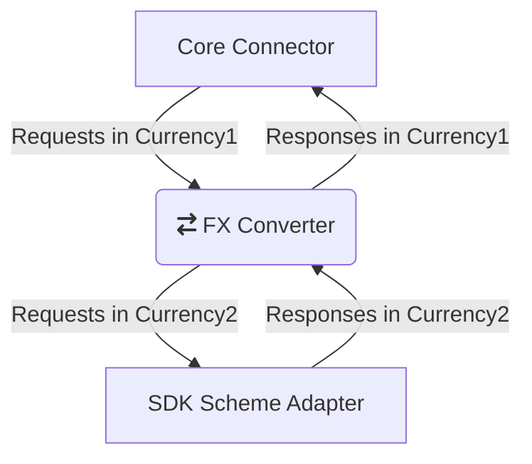

# [EXPERIMENTAL] FX Converter Template

<!-- ACTION: REPLACE fx-converter-template placeholders in this document -->
[](https://github.com/mojaloop/fx-converter-template/commits/master)
[](https://github.com/mojaloop/fx-converter-template/releases)
[](https://www.npmjs.com/package/@mojaloop/fx-converter-template)
[](https://www.npmjs.com/package/@mojaloop/fx-converter-template)
[](https://circleci.com/gh/mojaloop/fx-converter-template)

[EXPERIMENTAL] A project template for FX conversion to be used between SDK and Core connectors.

`This repository is still under development`

## Contributing

Refer to [CONTRIBUTING.md](./CONTRIBUTING.md) for information on how to contribute, committing changes, releases and snapshots.

---

## Overview

This repository is a sample implementation for the FX converter. The actual implementation may vary based on the business usecases and rules.
The FX converter sits between SDK and Core connector.
So FX converter speaks sends SDK outbound API requests to SDK service and Core connector API requests to speak to core connector service.

## Block diagram



---

## Pre-requisites

### Install dependencies

```bash
npm install
```

## Build

Command to transpile Typescript into JS:

```bash
npm run build
```

Command to LIVE transpile Typescript into JS live when any changes are made to the code-base:

```bash
npm run watch
```

## Run

```bash
npm start
```

## Tests

```bash
npm test
```